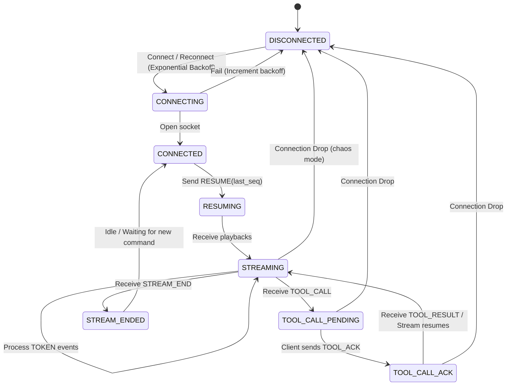

# Conduit — Agent Observability Console

Conduit is a state-of-the-art AI agent observability console built with **Next.js (App Router)** and styled using a custom **Neobrutalism** palette. It connects to the Alchemyst AI Agent WebSocket server, rendering real-time streaming tokens, mid-stream tool execution cards, trace timelines, and context snapshot diffs. Under the hood, it implements an event-sourced reordering buffer and connection recovery layer to survive connection drops and message shuffling in **chaos mode**.

---

## Architectural Approach

Conduit separates raw network ingestion from the UI render loop. Incoming WebSocket events are routed through a sequence-based **reorder buffer** that enforces strict monotonicity, deduplicates redundant packages, and sorts out-of-order packets. Once the protocol engine validates the sequence, it commits the messages to the agent state machine, triggering smooth, layout-shift-free visual updates across the Trace Timeline, Streaming Feed, and Context State Panels.

---

## State Machine Diagram

Below is the WebSocket protocol state machine and connection state lifecycle:



---

## Features

1. **Neobrutalism Design System**: Structured with thick black borders, hard flat shadows, monospace typography, and a custom teal (`#5eead4`) / cream (`#e8e0d4`) palette for high readability.
2. **Layout Shift-Free Streaming**: Streaming text blocks freeze in place during active tool calls, rendering tool status cards inline and resuming from the precise boundary upon receiving results.
3. **Trace Timeline**: An expandable side timeline displaying every event. Consecutive tokens are auto-batched into collapsible summaries to prevent render-loop fatigue.
4. **Context State Inspector**: A JSON tree visualizer showing context snapshots, automatic property diffing (+NEW, CHG, DEL), and historical step scrubbing.
5. **Auto Test Suite**: A sequenced automated integration test widget allowing developers to run basic messaging, tool execution, large context data, and network drops sequentially.

---

## Getting Started & Run Instructions

### 1. Prerequisites
- **Node.js**: Ensure Node.js 20+ is installed.
- **Docker**: For running the backend agent-server.

### 2. Start the Mock Backend Server
Navigate to the `agent-server` directory, build, and start the container:

**Normal Mode:**
```bash
cd agent-server
docker build -t agent-server .
docker run -p 4747:4747 agent-server
```

**Chaos Mode:**
```bash
docker run -p 4747:4747 agent-server --mode chaos
```

### 3. Start the Next.js Frontend Console
Navigate to the `agent-console` directory, install dependencies, and start the development server:

```bash
cd agent-console
npm install
npm run dev
```

Open [http://localhost:3000](http://localhost:3000) in your web browser.

---

## Running the Automated Test Suite

1. Open the application in your browser.
2. Click the floating **Auto Test Runner** button in the bottom right corner of the screen.
3. Click **START SUITE**.
4. The test suite will automatically:
   - Reset the session
   - Send greeting messages
   - Simulate and verify tool calls
   - Load a large database schema
   - Disconnect and reconnect to verify buffer recovery

---

## Visual Walkthrough & Screenshots

Below are illustrations and layouts of the observer console running in normal and chaos mode:

### A. Streamed Response with Tool Call
The streaming panel maintains frozen blocks while tool execution is active, showing immediate feedback:


### B. Trace Timeline
The timeline lists sequence numbers `#N` with specific badges. Consecutive `TOKEN` events are grouped under a single accordion indicating token counts and elapsed time.

### C. Context Inspector
The inspector visualizes active snapshots with hierarchical colors highlighting added properties in green, modified in orange, and deleted keys in red.